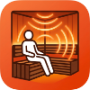

<p align="center">
  
</p>

# homebridge-clearlight-sauna

[](https://www.npmjs.com/package/homebridge-clearlight-sauna)
[](https://www.npmjs.com/package/homebridge-clearlight-sauna)
[](https://homebridge.io)

Homebridge plugin for Clearlight and Jacuzzi infrared saunas. Control your sauna with Siri, the Apple Home app, or any HomeKit automation — power, temperature, lights, and a ready notification when your sauna hits target temp.

Communicates directly with the sauna over your local network. No cloud, no subscription, no internet connection required.

<p align="center">
  
</p>

## Features

- Power on/off and target temperature via Siri or the Home app
- Internal and external cabin light control
- Auto-discovers your sauna on the local network — no IP address config needed
- Stable MAC address-based device identity: survives DHCP lease rotation
- Optional "At Temperature" sensor: get a native HomeKit push notification when your sauna is ready
- Live device status panel in Homebridge Config UI (last seen, IP, MAC)
- Per-sauna settings: name, temperature range, light names
- Reliable control with ACK verification — Home app shows "No Response" if the sauna is unreachable rather than silently failing
- Local LAN only. Zero cloud dependency.

## What You Get in HomeKit

| Control | HomeKit Service | Siri Example |
|---------|----------------|--------------|
| Power + temperature | HeaterCooler | "Hey Siri, turn on the sauna" / "Set the sauna to 60 degrees" |
| Internal cabin light | Switch | "Turn on the sauna light" |
| External light | Switch | "Turn on the external light" |
| Ready notification | Occupancy Sensor (optional) | Triggers when sauna reaches target — enable notifications in Home app |

LED/chromotherapy brightness is read-only in the protocol (set from the sauna's physical panel).

## Compatibility

Tested with the Clearlight Sanctuary range. Should work with any Clearlight or Jacuzzi infrared sauna fitted with the WiFi module (Gizwits GAgent firmware). If you've confirmed it working on another model, open an issue and I'll add it to the list.

## Install

### Via Homebridge UI (recommended)

Search for `clearlight` in the Homebridge plugins tab and install.

### Via command line

```bash
npm install -g homebridge-clearlight-sauna
```

## Configuration

Saunas are auto-discovered on your local network — just install the plugin and your sauna will appear in HomeKit. No configuration required for most users.

### Find your sauna's MAC address

Run the discover command from the Homebridge plugin directory, or use your router's device list:

```bash
npm run sauna -- discover
```

Output includes the MAC address, IP, and a ready-to-paste config snippet.

### Pin a sauna by MAC address (recommended)

Pinning by MAC address ensures the plugin always finds your sauna even if its IP address changes (DHCP lease rotation).

```json
{
  "platform": "ClearlightSauna",
  "name": "Clearlight Sauna",
  "devices": [
    {
      "mac": "aa:bb:cc:dd:ee:ff",
      "name": "Sauna",
      "minTemp": 40,
      "maxTemp": 70,
      "atTempSensor": true
    }
  ]
}
```

### Platform options

| Field | Default | Description |
|-------|---------|-------------|
| `name` | `"Clearlight Sauna"` | Platform name |
| `discoveryTimeout` | `5` | Seconds to listen for saunas per scan |
| `discoveryInterval` | `60` | Seconds between network scans |
| `minTemp` | `16` | Default minimum target temperature (°C) |
| `maxTemp` | `66` | Default maximum target temperature (°C) |
| `devices` | `[]` | Pinned sauna list (see below) |

### Per-sauna options

| Field | Description |
|-------|-------------|
| `mac` | Hardware MAC address — preferred. Stable across IP changes. |
| `did` | Gizwits device ID — alternative to MAC if MAC is unavailable. |
| `name` | Display name in HomeKit |
| `minTemp` | Minimum temperature slider value (°C) |
| `maxTemp` | Maximum temperature slider value (°C) |
| `defaultTemp` | Temperature shown before the sauna reports its set point |
| `internalLightName` | Name for the internal light switch in HomeKit |
| `externalLightName` | Name for the external light switch in HomeKit |
| `atTempSensor` | `true` to add an occupancy sensor that triggers at target temperature |

> `host` (static IP) is deprecated. Use `mac` instead — it will break when the DHCP lease rotates.

### At Temperature notification

Enable `atTempSensor: true` on a device, then open the Home app, find the "At Temperature" sensor, and enable notifications. You'll get a native push notification on your iPhone/Apple Watch when the sauna is ready.

## CLI Tool

A diagnostic CLI is included for testing and direct control. Run from the plugin source directory:

```bash
npm run sauna -- discover          # find saunas on the network (shows MAC + IP)
npm run sauna -- status            # full state dump
npm run sauna -- power on          # turn on
npm run sauna -- power off         # turn off
npm run sauna -- temp 55           # set target to 55°C
npm run sauna -- light int on      # internal light on
npm run sauna -- light ext off     # external light off
npm run sauna -- heater 200 200    # left/right heater intensity
npm run sauna -- timer 45          # 45 minute session
npm run sauna -- monitor           # live state stream
```

## Protocol

The sauna's WiFi module runs Gizwits GAgent firmware and communicates over the local network only:

- UDP broadcast on port 12414 (discovery)
- TCP binary on port 12416 (auth, control, state)
- Auth: passcode negotiation per device, then heartbeat every 4s
- Controls are async: ACK (0x94) arrives ~2-4s after command, state update follows

Full protocol notes in [src/gizwits/protocol.ts](src/gizwits/protocol.ts).

## Development

```bash
git clone https://github.com/Mustavo/homebridge-clearlight-sauna.git
cd homebridge-clearlight-sauna
npm install
npm run build     # compile TypeScript
npm run watch     # compile on change
npm run sauna     # CLI tool (from source)
```

## Release Checklist

Publishing from the monorepo works via a clean clone at `/tmp/sauna-release`. Steps every release:

```bash
# 1. Bump version in package.json + add CHANGELOG entry, sync to /tmp/sauna-release
# 2. Commit, tag, push to GitHub
git -C /tmp/sauna-release add -A
git -C /tmp/sauna-release commit -m "vX.Y.Z - summary"
git -C /tmp/sauna-release tag vX.Y.Z
git -C /tmp/sauna-release push origin master --tags

# 3. Create a GitHub Release (required — Homebridge reads release notes from here)
gh release create vX.Y.Z --repo Mustavo/homebridge-clearlight-sauna --title "vX.Y.Z" --notes "..."

# 4. Publish to npm (from the clean clone, not the monorepo)
cd /tmp/sauna-release
npm publish
```

> If the GitHub Release is missing, Homebridge shows "Could not retrieve release notes" in the update modal.

## Licence

ISC
