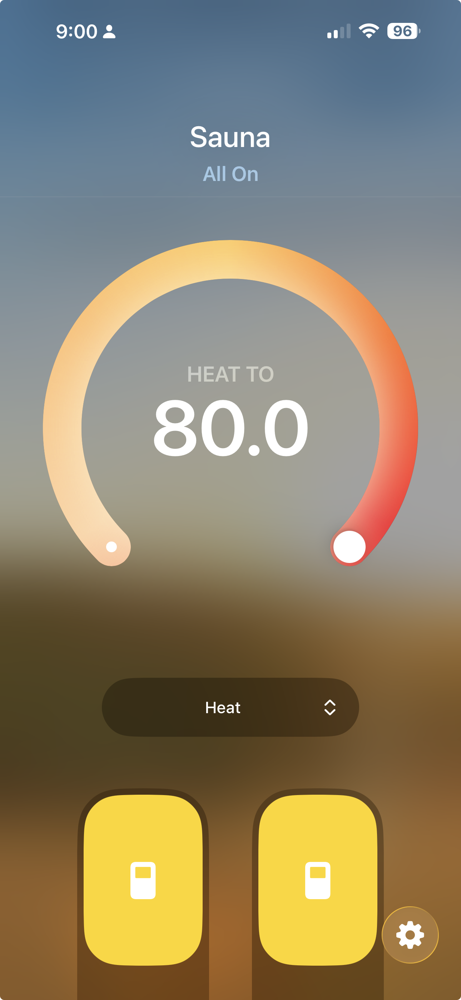

# homebridge-clearlight-sauna

[](https://www.npmjs.com/package/homebridge-clearlight-sauna)
[](https://www.npmjs.com/package/homebridge-clearlight-sauna)
[](https://homebridge.io)

Homebridge plugin to control a Clearlight/Jacuzzi infrared sauna via Apple HomeKit and Siri.

Communicates directly with the sauna over your local network using the Gizwits GAgent binary protocol. No cloud, no internet required.

<p align="center">
  
</p>

## Features

- Power on/off and target temperature via Siri or the Home app
- Internal and external light control
- Auto-discovers your sauna on the local network (UDP broadcast)
- Configurable via the Homebridge UI (Settings tab)
- Standalone CLI for direct sauna control and diagnostics
- Zero dependencies beyond Homebridge

## What You Get in HomeKit

| Control | HomeKit Service | Siri Example |
|---------|----------------|--------------|
| Power + temperature | HeaterCooler | "Hey Siri, turn on the sauna" / "Set the sauna to 60 degrees" |
| Internal light | Switch | "Turn on the internal light" |
| External light | Switch | "Turn on the external light" |

LED/chromotherapy is read-only (controlled from the sauna's physical panel).

## Compatibility

Tested with the Clearlight Sanctuary range. Should work with any Clearlight or Jacuzzi infrared sauna that has the WiFi module (Gizwits GAgent firmware on port 12416). If you've confirmed it working on another model, open an issue and let us know.

## Install

### Via Homebridge UI (recommended)

Search for `clearlight` in the Homebridge UI plugin tab and install.

### Via command line

```bash
npm install -g homebridge-clearlight-sauna
```

## Configuration

Add to your Homebridge `config.json` accessories array, or configure via the Homebridge UI Settings tab:

```json
{
  "accessory": "ClearlightSauna",
  "name": "Sauna",
  "host": "192.168.1.XXX",
  "minTemp": 16,
  "maxTemp": 66,
  "pollingInterval": 10
}
```

| Field | Required | Default | Description |
|-------|----------|---------|-------------|
| accessory | Yes | - | Must be `"ClearlightSauna"` |
| name | Yes | `"Sauna"` | Name shown in HomeKit |
| host | No | Auto-discover | Sauna's IP address. Leave blank to auto-discover via UDP broadcast. A static IP (DHCP reservation) is recommended. |
| minTemp | No | `16` | Min target temp in Celsius |
| maxTemp | No | `66` | Max target temp in Celsius (66C = 150F) |
| pollingInterval | No | `10` | Seconds between state polls |

## CLI Tool

A standalone CLI is included for direct sauna control and diagnostics:

```bash
npx homebridge-clearlight-sauna discover        # find sauna on network
npx homebridge-clearlight-sauna status           # full state dump
npx homebridge-clearlight-sauna power on         # turn on
npx homebridge-clearlight-sauna power off        # turn off
npx homebridge-clearlight-sauna temp 55          # set target to 55C
npx homebridge-clearlight-sauna light int on     # internal light on
npx homebridge-clearlight-sauna light ext off    # external light off
npx homebridge-clearlight-sauna heater 200 200   # left/right heater intensity
npx homebridge-clearlight-sauna timer 45         # 45 min session
npx homebridge-clearlight-sauna monitor          # live state stream
```

## Protocol

Local LAN only. The sauna's WiFi module runs the Gizwits GAgent firmware:
- TCP binary on port 12416 (all control/state)
- UDP broadcast on port 12414 (discovery)
- Auth: passcode request/login, then heartbeat every 4s
- Controls processed async: ACK (0x94) arrives ~2-4s after command

Full protocol details in [src/gizwits/protocol.ts](src/gizwits/protocol.ts).

## Development

```bash
git clone https://github.com/Mustavo/homebridge-clearlight-sauna.git
cd homebridge-clearlight-sauna
npm install
npm run build     # compile TypeScript
npm run watch     # compile on change
npm run sauna     # CLI tool (from source)
```

## Licence

ISC
